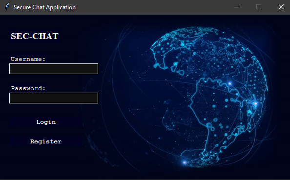
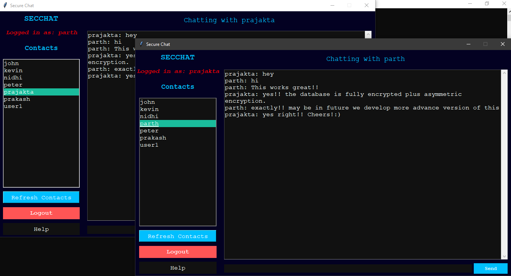

# Secure Chat Application


A Python-based secure and anonymous chat application with asymmetric encryption messaging, designed to provide privacy-focused communication. The application supports local and cross-network communication, leveraging encryption and user authentication.

---

## Features

- **End-to-End Encryption**: All messages use asymmetric encryption to ensure secure communication.
- **User Authentication**: Registration and login functionality with encrypted local storage for user credentials.
- **Cross-Network Functionality**: Supports communication across different networks (e.g., from one country to another).
- **Local Data Storage**: Only usernames and encrypted credentials are stored locally.
- **Dark-Themed GUI**: A modern GUI with a cybersecurity theme for ease of use.
- **Modular Design**: Components for login, registration, and chat functionality are well-structured and modular.

---

## Requirements

- Python 3.8 or higher
- Required libraries (install via `pip install -r requirements.txt`):
  - `tkinter`
  - `websockets`
  - `cryptography==41.0.0`
  - `pillow==10.0.0`
  - `pytest==7.4.0`
  - `pytest-mock==3.11.1`
  - `sqlite3`

---

## Installation

1. Clone the repository:
   ```bash
   git clone https://github.com/CrashNBurn1337/SecureChatApplication.git
   cd SecureChatApplication
   ```

2. Install dependencies:
   ```bash
   pip install -r requirements.txt
   ```

3. Run the application:
   ```bash
   python socket_server.py
   python main.py #client appication
   ```

---

## Usage

1. **Registration**: Create a new account by providing a username and password. Credentials are securely stored using encryption.
2. **Login**: Log in to the application to access the chat interface.
3. **Chat Securely**: Exchange encrypted messages in real-time. Messages are displayed in a chat interface, formatted with sent and received messages aligned left and right, respectively.
4. **Logout**: Safely exit the application using the logout button.

---

## Architecture

The application follows a structured development approach:

1. **Encryption**: Ensures data security during transmission and storage.
2. **WebSocket Communication**: Provides real-time, low-latency messaging between peers.
3. **Tkinter GUI**: A user-friendly graphical interface with a dark theme.
4. **Local Storage**: Stores encrypted credentials in a sqlite3 local database.

---

## Screenshots

### Login Screen



### Chat Interface

---

## Development Roadmap

- **Completed:**
  - Local network chat functionality
  - Encryption and authentication
  - GUI design and implementation

- **Planned Features:**
  - Integration with Tor network for enhanced anonymity
  - Advanced message delivery confirmation

---
